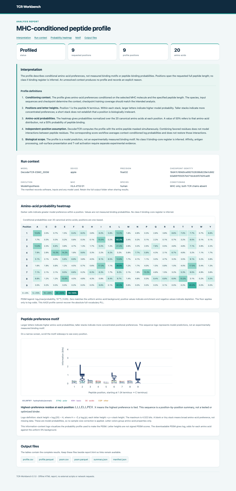

# TCR-Workbench

**A command-line toolkit for TCR–pMHC modeling with [DecoderTCR](https://github.com/Biohub/DecoderTCR).**

For Google Colab notebooks and Hugging Face inference, visit [TCR Challenge](https://tcrchallenge.org).

- **Score peptides** in an MHC or paired αβ TCR–MHC context.
- **Generate conditional peptide profiles and PSSMs**, with sequence logos and amino-acid heatmaps.
- **Screen processed TCR repertoires** against a peptide–MHC panel, or annotate receptors by matching a curated reference.

Analyses run locally on CPU, Apple Silicon or NVIDIA GPU and produce offline HTML reports. See [Models and hardware](#models-and-hardware) for coverage.

[Choose a workflow](#choose-a-workflow) · [Install and try it](#install-and-try-it) · [Usage](#usage) · [Outputs and methods](#read-your-results) · [Models](#models-and-hardware) · [Benchmarks](#published-decodertcr-benchmarks) · [Documentation](#documentation-and-help)

## Choose a workflow

Command line inputs include **human and mouse conventional αβ TCRs**, **class I and II MHC reference molecules**, and **processed 10x Cell Ranger V(D)J, AIRR or paired receptor tables**. Choose a checkpoint trained with the intended species; see [species and class II requirements](#human-mouse-and-class-ii-inputs).

| What you want to do | Required inputs | Command |
|---|---|---|
| Test candidate peptides for an MHC | Peptide panel with MHC allele (one row is sufficient) | [`pmhc-score`](#1-compare-peptides-for-an-mhc) |
| Generate an MHC-conditioned peptide profile | MHC molecule and peptide length | [`pmhc-profile`](#3-run-a-peptide-profile) |
| Test candidate peptides for a TCR | TCR, MHC and peptide or panel | [`tcr-score`](#2-investigate-one-tcr) |
| Generate a TCR–conditioned peptide profile | TCR, MHC and peptide length | [`tcr-profile`](#2-investigate-one-tcr) |
| Test TCR clonotypes against a peptide panel | Repertoire and peptide–MHC panel; donor typing recommended | [`repertoire-score`](#3-screen-a-t-cell-repertoire) |
| Match exact or similar TCR receptors | Repertoire, curated reference, peptide panel and donor typing | [`screen`](#reference-matching-without-model-weights) |

Scores rank candidates for experimental testing; they do not establish binding, affinity or T-cell activation. TCR peptide predictions require a specific MHC molecule in the input.

## Install and try it

### 1. Download the folder

On [akds/tcr-workbench](https://github.com/akds/tcr-workbench), choose **Code → Download ZIP**, extract it and enter the repository folder:

```sh
cd ~/Downloads/tcr-workbench-main
python3 --version
```

The launcher requires **Python 3.9+**; setup provisions Python 3.12 for its managed environments. Choose a permanent folder before setup; moving it afterward can break saved paths. [Python prerequisites](docs/quickstart.md#check-python).

<details>
<summary>Prefer Git?</summary>

```sh
git clone https://github.com/akds/tcr-workbench.git
cd tcr-workbench
```

</details>

### 2. Run setup once

Choose **one** command for your computer:

**Mac with an Apple M-series chip:**

```sh
python3 tcr.py setup --device apple
```

**CPU on Mac or Linux:**

```sh
python3 tcr.py setup --device cpu
```

**NVIDIA GPU on Linux:**
<details>
<summary>Requirements</summary>
This requires working NVIDIA drivers. CUDA dependencies need additional disk space.
</details>


```sh
python3 tcr.py setup --device gpu
```

Setup installs dependencies, reference sequences and **DecoderTCR 300M**. The checkpoint download is about **4 GB**. Allow at least **12 GB of free disk space**, plus space for Apple conversion and caches. Setup needs internet access; prepared analyses run locally without manual environment activation.

### 3. Run a peptide profile

Run these commands from the folder containing `tcr.py`:

```sh
python3 tcr.py doctor
python3 tcr.py pmhc-profile --hla 'HLA-A*02:01' --length 9 --out results/first-profile
```

`doctor` checks the installation. `pmhc-profile` computes position-specific amino-acid preferences for a nine-residue peptide conditioned on HLA-A*02:01.

Open **`results/first-profile/report.html`** for the profile heatmap, sequence logo and execution details. `profile.csv` contains the amino-acid probabilities; `pssm.csv` contains the position-specific scoring matrix. See [Read your results](#read-your-results) for their relationship to PLL scores.

The first analysis may take longer while the model is prepared. Later runs reuse prepared files. Setup saves your device choice, so future commands do not need the `--device` flag. **Use a new `--out` folder for each run**, such as `results/first-profile-2` when repeating this example. You can rerun setup to reset the device choice.

<details>
<summary>See an example report without installing the model</summary>

Download the repository and open the [profile report](docs/examples/hla-profile/report.html) or [peptide scoring report](docs/examples/peptide-scores/report.html) in your browser. GitHub displays HTML source rather than running the report.



These tables show DecoderTCR 300M predictions on Apple Silicon, without experimental binding labels.

</details>

## Usage

Run all TCR-Workbench commands from the code/repository folder. The examples below use the device and default checkpoint saved during setup.

### 1. Compare peptides for an MHC

`pmhc-score` evaluates a peptide panel in its MHC context without a TCR input. Supply a CSV with `peptide` and `hla` columns:

```csv
peptide,hla
GILGFVFTL,HLA-A*02:01
NLVPMVATV,HLA-A*02:01
```

Run the included panel:

```sh
python3 tcr.py pmhc-score --panel examples/panel.csv --out results/pmhc-panel
```

Open **`results/pmhc-panel/report.html`**. It shows up to ten distinct top-ranked peptides **within each MHC and peptide-length group**, and their score distribution against random peptides. Every input remains in the full results table, including any that could not be scored.

By default, 1,000 random peptides are scored per MHC/length group. Each residue is drawn independently with equal probability from the 20 standard amino acids. These are a reference distribution, not experimentally verified nonbinders. Both `pmhc-score` and `tcr-score` accept `--background-peptides 0` to omit this comparison; [the workflow guide](docs/usage.md) explains the count and seed options.

**PLL and panel rank are the main outputs.** To compare with peptides sampled from the MHC-only profile instead, add `--background-mode mhc-profile`. The default is 1,000 samples; set the count with `--background-peptides N`. For `tcr-score`, generation uses only the MHC, then scoring uses your TCR–MHC pair. `background_percentile` reports the upper-tail reference percentile (lower is better), not a probability of binding.

If you have only the MHC and a peptide length, use `pmhc-profile` as in the first example. Its motif describes positional preferences.

### 2. Investigate one TCR

Use `tcr-score` when you know a receptor's **alpha and beta chains** and want to compare peptides in one MHC context. Supply each chain's V gene, J gene and amino-acid junction sequence, including its conserved starting **C** and terminal **F/W** anchors.

Run the public receptor example against the included peptide panel:

```sh
python3 tcr.py tcr-score \
  --trav TRAV21 --traj TRAJ6 --cdr3a CAVRPGGAGPFFVVF \
  --trbv TRBV7-9 --trbj TRBJ2-7 --cdr3b CASSLGQAYEQYF \
  --hla 'HLA-A*02:01' --panel examples/panel.csv --out results/tcr-panel
```

Open **`results/tcr-panel/report.html`** for the ranked peptides and random-peptide comparison. Replace all six gene/junction values with your experimental annotations. For a single peptide, replace `--panel examples/panel.csv` with `--peptide GILGFVFTL`.

To explore peptide preferences without supplying candidates:

```sh
python3 tcr.py tcr-profile \
  --trav TRAV21 --traj TRAJ6 --cdr3a CAVRPGGAGPFFVVF \
  --trbv TRBV7-9 --trbj TRBJ2-7 --cdr3b CASSLGQAYEQYF \
  --hla 'HLA-A*02:01' --length 9 --out results/tcr-profile
```

This produces a motif and PSSM conditioned on the **TCR as well as the MHC**. Check the report's gene choices and reconstruction warnings: the software builds full receptor chains from your annotations, and those choices matter.

### 3. Screen a T-cell repertoire

Use `repertoire-score` to compare clonotypes from a single-cell experiment against a candidate peptide panel. Supply donor MHC typing when available. Try the included example:

```sh
python3 tcr.py repertoire-score \
  --input examples/paired.csv --format paired \
  --panel examples/panel.csv --donors examples/donors.csv --out results/repertoire-demo
```

Open **`results/repertoire-demo/report.html`**. The example contains three synthetic cells. The output retains the cell with an incomplete receptor.

For single-donor 10x Cell Ranger output, put your files in `data/` and run:

```sh
python3 tcr.py repertoire-score \
  --input data/filtered_contig_annotations.csv --format 10x --donor-id donor_1 \
  --panel data/peptides.csv --donors data/donors.csv --out results/donor_1-screen
```

Use the same `donor_1` identifier in the donor table. AIRR rearrangement files use `--format airr`; paired tables use `--format paired`. Check the [required columns and pairing rules](docs/input-formats.md) before using your own data. Without donor typing, the panel specifies the model's MHC context, but donor compatibility is unconfirmed.

Scores are ranked within each receptor/MHC/peptide-length group. Output tables link cells, chains and receptors. Dual-alpha chains, nonproductive rearrangements and incomplete pairs remain in those records; current model scoring requires a complete, unambiguous alpha–beta pair. Start from processed tables, not raw FASTQ files.

### Reference matching without model weights

`screen` checks whether your receptors match antigen-associated records in a reference table you supply. It uses reference evidence and needs no model download:

```sh
python3 tcr.py setup --core-only
python3 tcr.py screen --input examples/paired.csv --format paired \
  --donors examples/donors.csv --panel examples/panel.csv \
  --reference examples/reference_synthetic.csv --out results/reference-demo
```

**Experimental embedding matching:** after a full model setup, add `--embedding-matching --embedding-top-k 10` to `screen`, using a new output folder. It requires paired V/J/CDR3 annotations and an explicit reference `species` column; both searches then use only reference rows of the requested species. Embedding neighbors appear separately in `embedding_matches.csv` and the HTML report; they do not assign antigen specificity. [Requirements and interpretation](docs/usage.md#experimental-embedding-matching).

A reference hit supports an annotation for review; a missing hit does not identify a new specificity. The included reference is **synthetic demonstration data**. Use a sourced, curated reference for research and inspect each match's source evidence and HLA compatibility. [Example files explained](examples/README.md).

## Read your results

Start with **`report.html`**, then inspect the complete CSV tables before choosing candidates for an experiment.

| Output | Interpretation |
|---|---|
| `status` and `reason` | Whether an input could be scored and what needs review. `Unresolved` does **not** mean nonbinding. |
| `receptor_id`, `hla`, `peptide`, `peptide_length` | Which receptor and target the row describes. |
| `score` and `rank` | Which candidates the model favors within the same receptor, MHC and peptide length. Higher scores rank first, including when all scores are negative. |
| Motif and PSSM | The model's amino-acid preferences at each peptide position. These are hypotheses, not measured binding motifs. |
| Run details and linked files | The checkpoint, settings, gene reconstruction and complete results. |

`Scored` and `ModelHypothesis` mean the model returned a finite numerical result. Neither is an experimental binding label. Compare scores from the same checkpoint, species, context, length and numerical precision.

### Peptide scoring

DecoderTCR masks all peptide positions simultaneously and predicts them from the fixed MHC or TCR–MHC context. The CLI's **PLL** score is the mean natural-log probability assigned to the candidate residues, using probabilities over the full model vocabulary:

```text
PLL = mean_i ln P(candidate residue_i | MHC, optional TCR, whole peptide masked)
```

This is an independent-position compatibility score, not leave-one-residue-out pseudo-log-likelihood. It does not recover interactions between peptide residues.

### Profiles and PSSMs

Profiles renormalize the predictions over the 20 canonical amino acids. PSSM entries are `log2(max(p, 1e-12) / 0.05)`, relative to a uniform amino-acid background. Logo stack heights show information content in bits; letter heights within each stack are proportional to the profile probabilities. These normalized profiles cannot reconstruct the absolute full-vocabulary PLL. [Scoring details and output definitions](docs/usage.md).

### Complete results and run details

Run details record the checkpoint and settings. Repertoire tables link cells, chains and receptors; reconstruction details show selected genes and unresolved inputs. For reference matching, inspect the matched record and its source evidence.

Reports open offline. Keep the whole output folder together when sharing so table links work. Peptide-score reports show the top ten per group; repertoire reports preview up to 200 rows. The complete tables retain the rest. Validate selected candidates with binding or functional assays appropriate to your question.

## Human, mouse and class II inputs

Human is the default. **For mouse**, add `--species mouse` to setup to install mouse receptor references, then include `--species mouse` on each analysis. A fresh Apple installation uses:

```sh
python3 tcr.py setup --device apple --species mouse
```

Use `--device cpu` for CPU setup. For an existing installation, follow the [mouse setup instructions](docs/usage.md#human-and-mouse) to reuse it. The `--hla` flag and `hla` column also hold mouse MHC names. The bundled reference includes **H-2-Kb, H-2-Db, H-2-IAb and H-2-IAk**.

Choose weights with training coverage appropriate to your species. New compatible mouse-trained checkpoints use the same workflows; `--species mouse` alone does not change a model's training. See [checkpoint selection](docs/upgrading.md) and [additional mouse MHC references](docs/input-formats.md#human-and-mouse).

**For human class II**, supply both MHC chains explicitly:

```sh
python3 tcr.py pmhc-profile \
  --hla 'HLA-DRA*01:01/HLA-DRB1*04:01' --length 15 --out results/class-ii-profile
```

The exact molecule must be in the model's reference. Workbench does not guess missing partners, resolve ambiguous HLA calls or determine class II binding registers. See the [class II panel example](examples/panel_class_ii.csv).

## Models and hardware

Workbench uses **DecoderTCR 300M, 600M and 6B**, fine-tuned from ESM-C. The default is **DecoderTCR 300M**. Benchmarks for different V0.3 models sizes are summarized in the next section. 

| Model | CPU / NVIDIA GPU | Apple Silicon |
|---|---|---|
| DecoderTCR 300M | Supported / Supported | Supported |
| DecoderTCR 600M | Supported / Supported | Supported |
| DecoderTCR 6B | Experimental / Supported | Experimental |

NVIDIA execution and 6B inference have not been tested with this tool. Default precision is FP32; our Apple 300M model also offers an optional approximate FP16 mode (`--precision float16`). Use FP16 for faster inference if local hardware resources are limited.

Select DecoderTCR 300M, 600M or 6B with `--model esmc-300m`, `--model esmc-600m` or `--model esmc-6b`. These existing CLI names refer to the fine-tuned DecoderTCR variants. Select hardware independently with `--device cpu`, `--device apple` or `--device gpu`, using the matching installed runtime and weights. The launcher checks new checkpoints automatically, prepares Apple weights when needed, and stops if estimated memory exceeds the available budget.

<details>
<summary>Use a new checkpoint or plan a larger run</summary>

To download a newer release, copy its checkpoint URL and SHA-256 into setup:

```sh
python3 tcr.py setup --device apple --model esmc-300m \
  --checkpoint-url 'HTTPS_DOWNLOAD_URL' --expected-sha256 SHA256
```

Use `esmc-600m` or `esmc-6b` for those sizes. Setup saves the selected weights as your default, so normal analysis commands stay the same. See [download options](docs/upgrading.md#download-a-new-release).

After setup, substitute the path to your compatible checkpoint:

```sh
python3 tcr.py prepare-model --model esmc-300m --device apple \
  --checkpoint /path/to/new-300M.ckpt

python3 tcr.py prepare-model --model esmc-6b --device apple \
  --checkpoint /path/to/6B.ckpt --plan
```

The second command estimates resources before preparation. Preparation does not change your saved default: include the matching `--model`, `--device` and `--checkpoint` flags on subsequent analysis commands to use those weights. New weights must match a supported architecture. Passing compatibility checks does not validate biological accuracy. See [model upgrades and memory planning](docs/upgrading.md).

</details>

## Published DecoderTCR benchmarks

The latest benchmarks are in the [DecoderTCR benchmark README](https://github.com/Biohub/DecoderTCR). The 600M and 6B models typically perform best on most classification tasks. 300M is a useful exploratory tool. **V0.3 benchmark results are summarized below:**

| Benchmark | Metric | 300M | 600M | 6B |
|---|---|---:|---:|---:|
| TCRvdb: receptors present in training | AUROC | **0.853** | 0.819 | 0.779 |
| IMMREP23: largely unseen receptors | Macro AUROC | 0.659 | **0.698** | 0.687 |
| Viral: ePytope-TCR benchmark | Macro AUROC | 0.640 | **0.657** | 0.644 |
| PRP: HLA-B*27:05 peptide-library retrieval | Macro AUPRC | 0.303 | 0.351 | **0.391** |

**AUROC** describes how well scores rank labeled binders above labeled nonbinders. **AUPRC** summarizes the balance between finding binders and including false positives; its baseline depends on binder prevalence. **Macro** means averaging across epitopes or receptor clones. These are not percentages of correct predictions. TCRvdb does not test new receptors; the Viral comparison assigns missing predictions a score of 0.5. PRP uses an anchor-fixed library. [Original figures, protocols and dataset citations](https://github.com/Biohub/DecoderTCR#results).

## Documentation and help

| Guide | Contents |
|---|---|
| [Quickstart](docs/quickstart.md) | Installation and a complete first analysis |
| [Input formats](docs/input-formats.md) | Required columns, chain pairing, donor typing and MHC names |
| [Workflow reference](docs/usage.md) | Commands, scoring options and output definitions |
| [Setup and troubleshooting](docs/setup.md) | Environments, downloads and installation problems |
| [Model upgrades](docs/upgrading.md) | Checkpoint compatibility, Apple conversion and memory planning |

For command options, run `python3 tcr.py COMMAND --help`, replacing `COMMAND` with a workflow name. Run `python3 tcr.py doctor` to inspect the installation. For an `Unresolved` result, check its reason and the input-format guide.

### Using an AI assistant

[Use an assistant](docs/agents.md) to help prepare inputs and run an analysis. All commands also work directly without an assistant.

## Citation and acknowledgments

If you use DecoderTCR, cite **Lai B, Englund M, Bharanikumar R, Nocedal I, Davariashtiyani A, Perera J, Khan AA. _DecoderTCR: Compositional Pretraining and Entropy-Guided Decoding for TCR-pMHC Interactions._ ICML, 2026.** [Paper](https://openreview.net/pdf?id=yzes8qBM70) · [Citation and BibTeX](https://github.com/Biohub/DecoderTCR#citation). Cite the source datasets used in your analysis as well.

The DecoderTCR research program acknowledges funding and support from **Biohub, NIH, University of Chicago, Huang Foundation, Breakthrough T1D, Lupus Research Alliance, and National Multiple Sclerosis Society**.

## License

Workbench code is [MIT licensed](LICENSE). Models, germline data and third-party components retain their own [terms and attribution](docs/model-notices.md).
